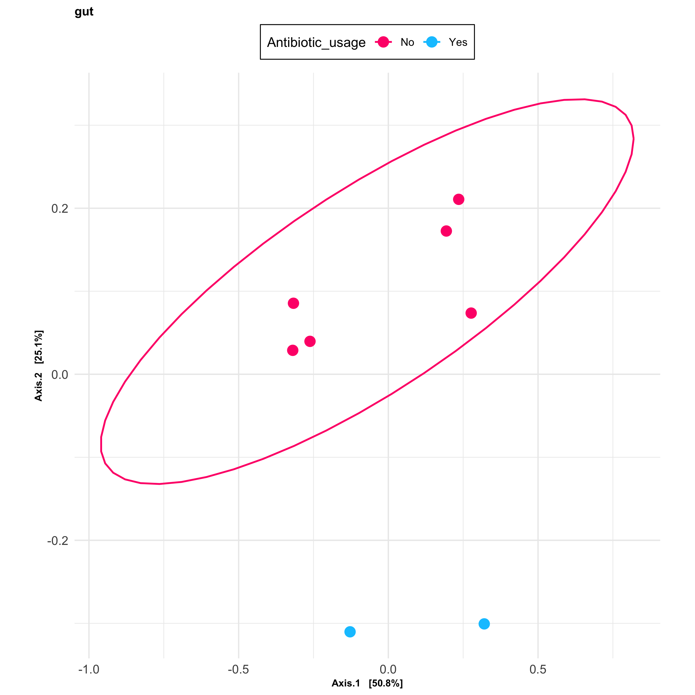
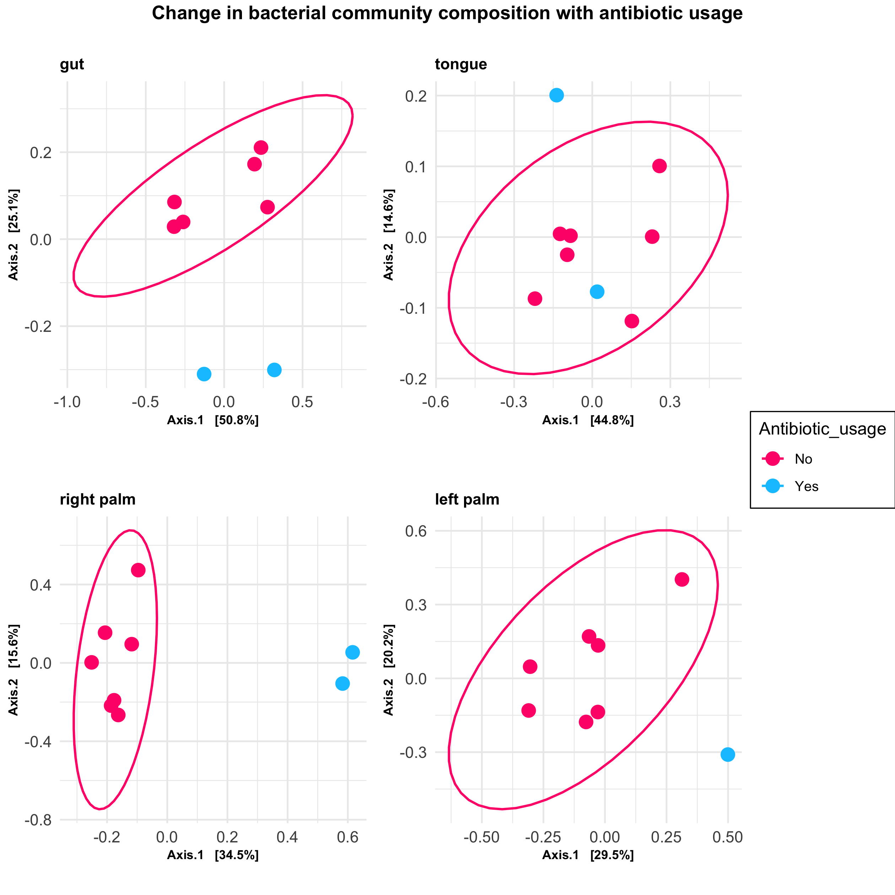

# Data visualisation in R 

Easy generation of ordination plots from [Qiime2](https://docs.qiime2.org/2020.2/tutorials/moving-pictures/) using [phyloseq](https://github.com/joey711/phyloseq) package. The code uses moving pictures tutorial output as an example. 

PCoA plots are first generated to visualise the change in bacterial community compostition for reported antibiotic use for each body site in the example dataset. 

**Initial setup**

1. Load packages required data import and colour selection
```
library(qiime2R)
library(phyloseq)
library(ggplot2)
library(ggpubr)
```

2.  Set working directory and load functions
```
setwd("./Data-Visualisation/")
source("./scripts/phyloseq_ordination.R")
```
3. Create colour scheme for visualisation 
```
colors<- c("#ff0078", "#00c5ff","#7fe2ff", "#b2edff")
```
4. Load example data (moving pictures tutorial)
```
phy_obj<-qza_to_phyloseq("table.qza", "rooted-tree.qza", "taxonomy.qza", "sample-metadata.tsv", tmp="tmpdir")
```

5. Create temporary directory and output directory for plots

```
dir.create("tmpdir")
dir.create("plots")
plot_dir=("./plots/")
```

**Make a list of the bodysites of interest** </br>

```
bodysites<- list("gut" , "left palm", "right palm", "tongue")
````

**Subset data and Generate plots**  </br>
Subset the data based on bodysite in our list and generate a PCoA plot for each site. A plot for each site will be saved in `./plots`. </br>

```
for (site in bodysites) {
  subset=subset_samples(phy_obj, Bodysite==site)
  name <- paste("plot_", site, sep = "")
  assign(name, generate_pcoa(subset, "bray", "Antibiotic_usage", site))
}
```

Example plot output




**Generate single plot for visualisation** </br>
Generate a single plot of all body sites investigated using [ggpubr](https://www.google.com/search?q=ggpubr&oq=ggpubr+&aqs=chrome..69i57j69i59l2j0l2j69i60l3.7908j0j7&sourceid=chrome&ie=UTF-8). This will allow us to observe the change in bacterial community composition with antibiotic usage for each site investigated using .

```
bodysites_pcoa<-ggarrange(plot_gut, plot_tongue,`plot_right palm`, `plot_left palm`, ncol=2, nrow=2, common.legend = TRUE, legend="right")
```

Annotate the merged figure using 
```
BS<-annotate_figure(bodysites_pcoa, top =text_grob("Change in bacterial community composition with antibiotic usage", color ="black", face ="bold", size =))
```

Save final plot
```
ggsave("./plots/bodysites_all.png", BS, width = 20, height = 20, units = c("cm"), dpi = 320)
```

